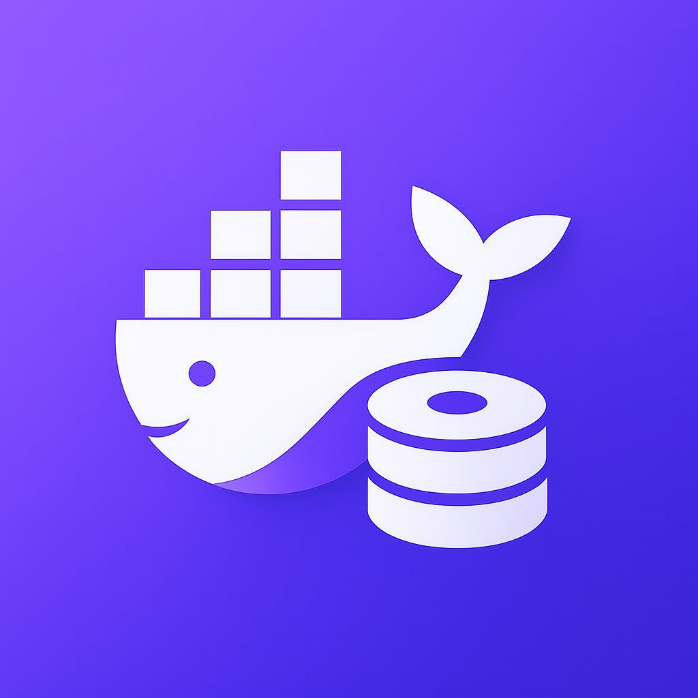
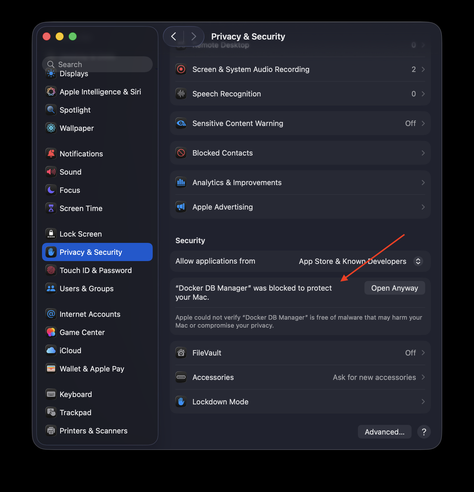

<div align="center">
  
  <h1>Docker DB Manager</h1>
  <p><strong>The easiest way to manage your Docker databases</strong></p>
</div>

<br />

<p align="center">
  <a href="https://github.com/AbianS/docker-db-manager/releases"></a>
  &nbsp;
  <a href="https://github.com/AbianS/docker-db-manager/blob/main/LICENSE"></a>
  &nbsp;
  <a href="https://github.com/AbianS/docker-db-manager/stargazers"></a>
  &nbsp;
  <a href="https://github.com/AbianS/docker-db-manager/issues"></a>
</p>

<hr/>

<h4 align="center">
  <a href="#-features"><strong>Features</strong></a> · 
  <a href="#-download"><strong>Download</strong></a> · 
  <a href="#-quick-start"><strong>Quick Start</strong></a> · 
  <a href="#-contributing"><strong>Contributing</strong></a>
</h4>

<hr/>

> [!IMPORTANT]
> **Currently available only for macOS**. Windows and Linux versions are in development and will be available soon.

Docker DB Manager is a desktop application that simplifies Docker database container management. No complex commands, no terminal, just an intuitive interface to create and manage your development databases.

<div align="center">
  
</div>

## 🎯 Features

- 🐳 **Intuitive visual management** - Create, start, stop, and delete containers with one click
- 🗄️ **Multiple databases** - Support for the most popular database engines
- 💾 **Data persistence** - Automatic Docker volume management
- 🔧 **Advanced configuration** - Custom ports, environment variables, and specific options
- 📋 **Copy connections** - Connection strings ready to use with one click
- 🔄 **Real-time sync** - Live status updates of your containers
- ⚡ **Native performance** - Built with Rust and Tauri v2
- 🆓 **100% free and open source** - No limits or subscriptions

## 📥 Download

Download the latest version for macOS from the [releases page](https://github.com/AbianS/docker-db-manager/releases).

**Available versions:**
- ✅ macOS (Apple Silicon & Intel)
- ⏳ Windows (coming soon)
- ⏳ Linux (coming soon)

**Requirements:**
- Docker installed and running
- macOS 10.15 or higher

### 🔒 macOS Security Notice

When you first open the app, macOS may show a security warning because the application is not notarized by Apple. To open the app:

1. Go to **System Settings** → **Privacy & Security**
2. Scroll down to the **Security** section
3. You'll see a message: *"Docker DB Manager was blocked to protect your Mac."*
4. Click the **"Open Anyway"** button
5. Confirm by clicking **"Open"** in the dialog

<div align="center">
  
</div>

## 📚 Quick Start

1. **Install Docker** if you don't have it yet
2. **Download Docker DB Manager** from [releases](https://github.com/AbianS/docker-db-manager/releases)
3. **Open the application** - it will automatically detect Docker
4. **Create your first container** with the step-by-step wizard
5. **Copy the connection string** and use it in your application

### Connection strings

The application automatically generates connection strings for each database type. Just copy and paste into your application.

## 🛠️ Development

Want to contribute or run the project locally?

```bash
# Clone the repository
git clone https://github.com/AbianS/docker-db-manager.git
cd docker-db-manager

# Install dependencies
npm install

# Run in development mode
npm run tauri dev

# Build for production
npm run tauri build
```

**Tech stack:** React 19, TypeScript, Rust, Tauri v2, Tailwind CSS

## 🤝 Contributing

Contributions are welcome! If you find a bug or have an idea:

1. Open an [Issue](https://github.com/AbianS/docker-db-manager/issues)
2. Fork the project
3. Create your feature branch (`git checkout -b feature/AmazingFeature`)
4. Commit your changes (`git commit -m 'Add some AmazingFeature'`)
5. Push to the branch (`git push origin feature/AmazingFeature`)
6. Open a Pull Request

## 📄 License

This project is licensed under GPL v3. See [LICENSE](LICENSE) for more information.

## ⭐ Like the project?

If you find Docker DB Manager useful, give it a star! ⭐

This helps more developers discover the tool.

---

<p align="center">Made with ❤️ for the developer community</p>
